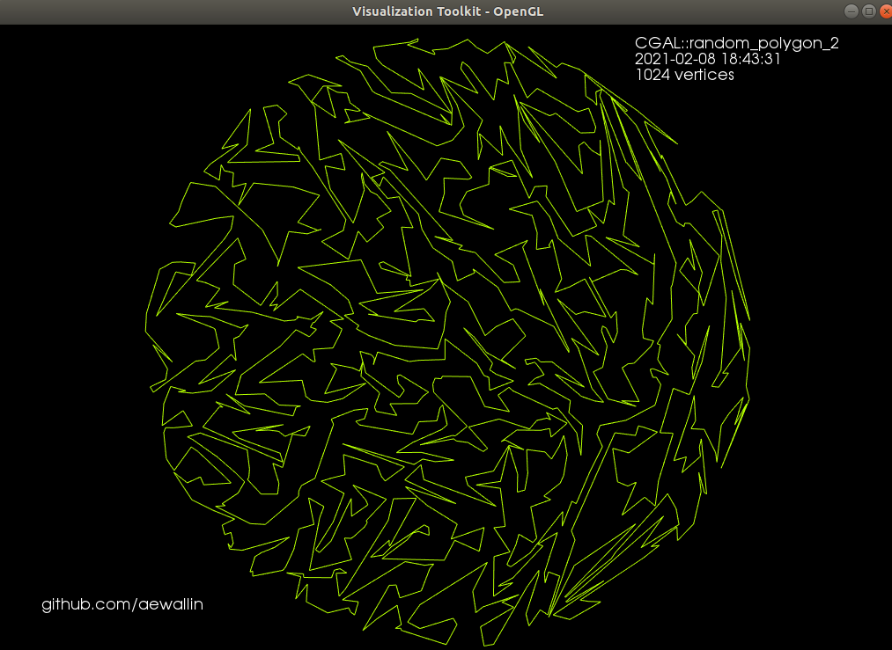

Randompolygon
=============

Anders Wallin (anders.e.e.wallin "at" gmail.com)
December 2011

This is a minimal boost::python module which wraps CGAL code 
from: http://www.cgal.org/Manual/latest/doc_html/cgal_manual/Generator_ref/Function_random_polygon_2.html
that uses the "2-opt" heuristic for generating a random polygon with N vertices.

Out-of-source build:

    make bld
    cd bld
    cmake .
    make
    sudo make install

Install from PPA:

    $ sudo add-apt-repository ppa:anders-e-e-wallin/cam
    $ sudo apt-get update
    $ sudo apt-get install randompolygon

todo: 
- generate many polygons with N vertices (using the same random set of points) with one call 
- random vertices are now hard-coded to be inside a unit-circle. 
- allow unit-box and scaling of the radius/size-of-box.

Example polygons
================
These example random polygons are generated with the included Python script, and visualized with VTK.

32 vertex example:

1024 vertex example:

